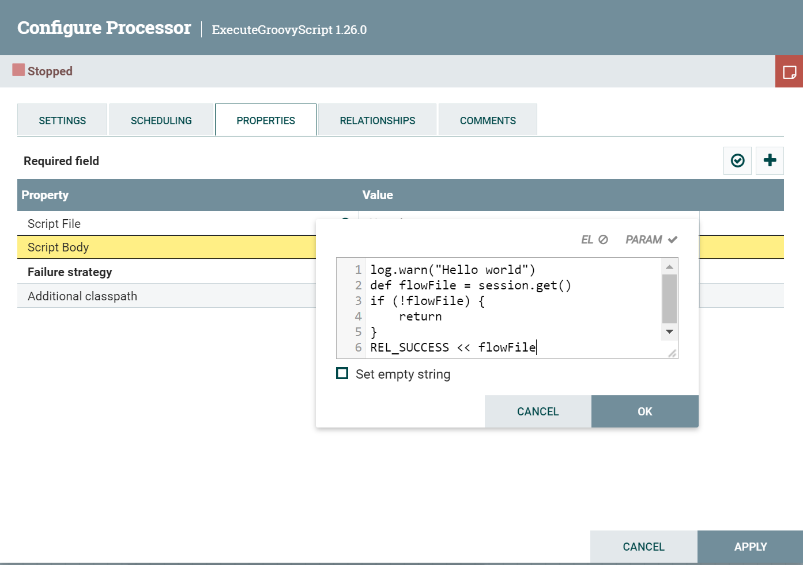
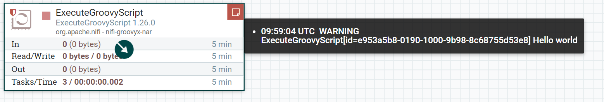

# NiFi Groovy Script

Run With NiFi Processor ExecuteGroovyScript

## Requirement

NiFi >= 1.26.0

## Manual

1. Create a class that implements **NiFiGroovyContext.class**. The method parameter is the NiFi script context.
2. Once the code is finished, copy the method body to the NiFi ExecuteGroovyScript Property (Script Body).
3. Run and test.

**Tips**

When copying the method body, you may also need to copy the import statements (import package ...). If you use JetBrains IntelliJ IDEA, you can configure it to always import as fully qualified names, allowing you to copy only the method body without the import statements.  
Settings -> Editor -> Code Style -> Groovy -> Imports (Tab), check the 'Use fully qualified class names' option. Enjoy it.


## Example
### HelloWorld
1. Create HelloWorld , just log "Hello world"

```groovy
import com.NiFiGroovyWrapper
import groovy.sql.Sql
import org.apache.nifi.controller.ControllerService
import org.apache.nifi.logging.ComponentLog
import org.apache.nifi.processor.ProcessContext
import org.apache.nifi.processor.ProcessSession
import org.apache.nifi.processor.Relationship
import org.apache.nifi.serialization.RecordReaderFactory
import org.apache.nifi.serialization.RecordSetWriterFactory

class HelloWorld extends com.NiFiGroovyWrapper {
    @Override
    void run(ProcessSession session,
             ProcessContext context,
             ComponentLog log, Relationship REL_SUCCESS,
             Relationship REL_FAILURE,
             Map<String, ControllerService> CTL,
             Map<String, Sql> SQL,
             Map<String, RecordReaderFactory> RecordReader,
             Map<String, RecordSetWriterFactory> RecordWriter) {
        log.warn("Hello world")
        def flowFile = session.get()
        if (!flowFile) {
            return
        }
        REL_SUCCESS << flowFile
    }
}
```
2.Copy method body to Processor
```groovy
log.warn("Hello world")
def flowFile = session.get()
if (!flowFile) {
    return
}
REL_SUCCESS << flowFile
```

3. Run the Processor. You should see bulletins displaying "ExecuteGroovyScript[id=] Hello world".
